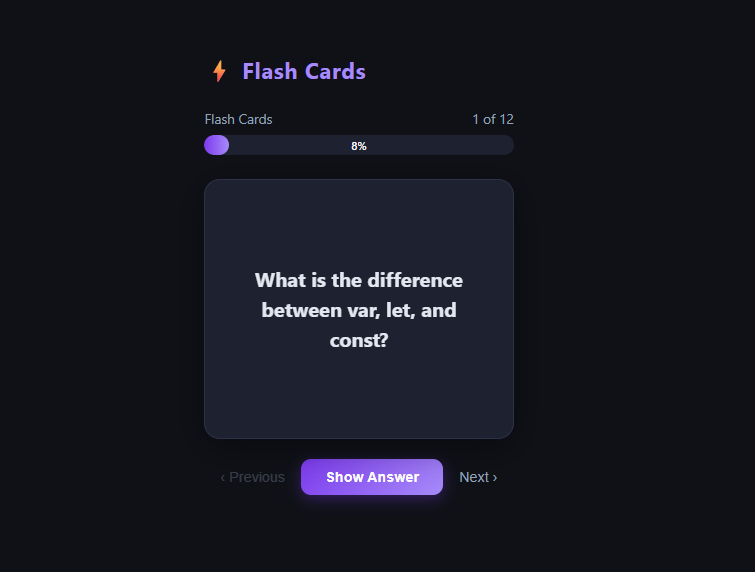

# ⚡ Flashcard App

A modern flashcard application built with **Angular** to help you study JavaScript concepts through interactive Q&A cards.


---

## 📸 Screenshots



---

## ✨ Features

- 🃏 Pre-defined JavaScript flashcards (questions & answers)
- 🔄 3D flip animation to reveal answers
- 📊 Progress bar showing current position
- ⬅️ ➡️ Simple navigation between cards
- 🌙 Dark mode UI

---

## 🚀 Getting Started

### Prerequisites

- Node.js 18+
- Angular CLI

```bash
npm install -g @angular/cli
```

### Installation

```bash
git clone https://github.com/SEU_USUARIO/flashcard-app.git
cd flashcard-app
npm install
ng serve
```

Open [http://localhost:4200](http://localhost:4200) in your browser.

---

## 🗂️ Project Structure
src/app/
├── components/
│   ├── flashcard/        # Card component with 3D flip
│   └── progress-bar/     # Progress indicator
├── data/
│   └── flashcard.data.ts # Questions & answers
└── app.component.ts      # Root component & state

---

## 🧠 Concepts Practiced

- Angular Signals (`signal`, `computed`)
- Standalone components
- `input()` / `output()` API
- CSS 3D transforms & transitions
- Component-based architecture

---

## 📄 License

MIT